### Introduction
With the completion of numerous genome sequencing projects, a vast amount of sequence data has been generated, which is applicable for various studies in biotechnology, healthcare, and evolutionary studies. The sequenced data contains valuable information for understanding various biological functions in cells. The huge size of the genomic data poses difficulty in analysing them without computational approaches. The computational methods efficiently analyze the data by processing, organizing, and interpreting the data with applicable mathematical principles. The expansion of newly sequenced genomes and the need for genome re-sequencing in genomics-based projects demanded computational tools in biological sequence analysis. By implementing algorithms, statistical models, and machine learning applications, the researchers can identify patterns and correlations, predict gene functions, find significant biological markers within the sequence data, and understand evolutionary relationships. Various algorithms have been used for biological sequence analysis.  Hidden Markov models (HMM) are well-known probabilistic models for analyzing biological sequences by profiling functional protein families and identifying functional domains. The Viterbi Algorithm is a dynamic programming solution for finding the most probable hidden state sequence in the Hidden Markov Models (HMM). The Viterbi algorithm requires a basic understanding of HMM model parameters for finding the maximum probability among all possible state sequences.

### Theory
 
 DNA is organized into discrete functional units known as genes. The genes are composed of deoxyribonucleic acid (DNA), except in some viruses, which consist of ribonucleic acid (RNA). The structure of DNA is a double helix composed of two chains of nucleotides that wind about each other to resemble a twisted ladder. The outer sides of the double helix are made up of sugars and phosphates, and the inside molecule is made up of the nucleotide bases adenine (A), thymine (T), guanine (G), and cytosine (C). An A on one chain bonds with T on the other, forming an A=T bond; similarly, a C on one chain bonds to a G on the other, forming G=C. The two strands separate during replication, and each serves as a template for the synthesis of a new complementary strand. Each gene is a segment of DNA that gives rise to a protein product or RNA. DNA replication is the biological process in which a double-stranded DNA molecule is copied, producing two identical copies of DNA from one original DNA molecule with the help of the enzyme DNA polymerase. The next step is the process of copying genetic information from DNA into messenger RNA (mRNA), known as transcription. During this step, the enzyme RNA polymerase binds to DNA and synthesizes a complementary RNA strand (mRNA), which carries genetic information from the DNA to the ribosomes. It occurs in the nucleus (in eukaryotic cells) or the cytoplasm (in prokaryotic cells). During translation, this mRNA sequence is translated into a specific protein. The transfer RNA (tRNA) molecules in the ribosomes bring amino acids that match the mRNA sequence, and the ribosomal RNA (rRNA) catalyzes peptide bond formation between amino acids. The genetic code, read in triplets (codons), determines the sequence of amino acids in the protein. This flow of genetic information, DNA → RNA → Protein, within a biological system explains the central dogma of molecular biology.

The gene structure has coding and non-coding regions that regulate its expression. A promoter region is a DNA sequence where RNA polymerase binds to initiate transcription. Most protein-coding genes in the human genome consist of nucleotide sequences, exons, and introns. Intron is a region that resides within a gene but does not remain in the final maturation of mRNA molecule. It is generally described as non-coding sequences (does not code for amino acids) that are transcribed but spliced out before translation. Exons represent the coding sequences that code for the amino acid sequence of the protein (Figure 1). The Chambons rule (GT-AG rule) states that most introns start with GT at the 5' end and AG at the 3' end. The transcription termination sequence represents a specific DNA sequence that functions at the end of transcription and releases a newly synthesized RNA molecule. In prokaryotes, rho-dependent or rho-independent mechanisms were involved in termination, while polyadenylation signals (AAUAAA) are common in eukaryotes. The untranslated regions (UTRs) represent mRNA sequences that are transcribed from DNA and not translated into proteins. 5' UTR found before the start codon AUG and helps in translation regulation. 3' UTR located after the stop codon (UAA, UGA, UAG) functions in providing mRNA stability and transport.

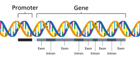

Figure 1. Structure of a gene

(Image source: https://www.genomicseducation.hee.nhs.uk/genotes/knowledge-hub/gene/) 

&nbsp;

One of the most challenging and intriguing problems in computational biology and bioinformatics is the identification of genes within DNA sequences. Finding genes involves identifying biologically functional nucleotide sequence stretches in the genomic DNA. Computational approaches of gene finding depend on using algorithms to locate protein-coding genes. Hidden Markov Models are widely used computational tools in bioinformatics that allow for the analysis of biological sequences for extracting meaningful information. This statistical model represents systems with hidden (unobservable) states and observable outputs. In biology, HMMs are powerful tools for analyzing genes, proteins, and evolutionary relationships by detecting patterns in biological sequences. With the advancing sequencing technologies and vast sequence data, HMMs will continue to play a crucial role in genomic research.

#### Viterbi algorithm in the context of Hidden Markov Models for exon-intron prediction

The Viterbi algorithm is dynamic programming that determines the optimal state path in the HMM, emitting the given sequence with the maximum probability. The HMM has two main entities, observables and hidden states. Observables are the elements seen by the user, but the hidden states are unknown and inferred based on the observables and their patterns. In the case of nucleotide sequence, the observables are individual bases while the hidden states would be introns and exons. That is, in case of sequence analysis, the Viterbi algorithm can be used for predicting coding and non-coding sequences. Similarly, for protein sequences, the observables would be the amino acids, and the states could be motifs and patterns. The three parameters that link the hidden and observable patterns are emission probabilities, transition probabilities, and initial probabilities. In case of gene finding, HMM includes states that represent different regions of a gene, such as the "start codon," "exon," "intron," and "stop codon." Each state specifies distinct probabilities of emitting specific nucleotide sequences. 

•	Emission probabilities: The probability of observing a hidden state from an observable, or in other words, the probability of a hidden state emitting an observable is the emission probability, represented by b.

•	Transition probabilities: The probability of transitioning from one hidden state to another is the transition probability, represented by a.

•	Initial probabilities: The probability of the first observable that is generated by a specific hidden state is called the initial probability, represented by π.

### Viterbi Algorithm for Exon-Intron Prediction

The Viterbi algorithm was proposed by Andrew Viterbi in 1967, which remains as an efficient algorithm for sequence-based probabilistic modelling. In gene prediction, the Viterbi algorithm predict whether each nucleotide in a DNA sequence belongs to an exon (coding region) or an intron (non-coding region).

It works as follows:

#### Step 1: Initialization 
During initialization, the algorithm set initial probabilities for all states in the Hidden Markov Model (HMM). 

#### Step 2: Recursion 
This step computes the most probable paths for each state at each time step using Transition probabilities (from previous states to the current state) and Emission probabilities (likelihood of observing the current symbol from the current state). 

#### Step 3: Termination
This identifies the final most probable state. This calculates the overall probability of the most likely state sequence. This step prepares for the backtracking to reconstruct the full state sequence.

#### Step 4: Backtracking 
This step traces back the most probable path and finds the most probable sequence of hidden states. 

#### Example of HMM model
Let’s consider a simplistic application of HMM on nucleotide sequences. It is clear that introns always start with GT and end with AG and that GC-rich regions are usually intronic. Based on that, the assumed probabilities would be:

Emission Probabilities (b):
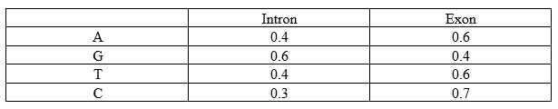

Transition Probabilities (a):
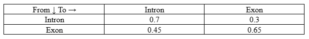

Initial Probabilities (π):
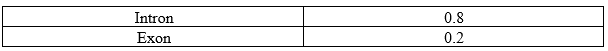

To calculate the Viterbi algorithm, the model must learn these parameters from known data. Here, the Baum Welch algorithm is applied. It first assumes parameters, analyses the data with them, and tweaks the parameters accordingly. The model’s accuracy and precision depend on its being trained with sufficient data.

### Baum-Welch Algorithm:
It is a variation of the Expectation-maximization algorithm and makes use of results from the Forward and Backward algorithms. Their results are used to re-estimate the parameters as per the data. It reapplies these algorithms and generates parameters repetitively until the generated parameters do not have any significant difference between them.

Let’s consider a sample DNA sequence: "ACTG"

The basic model would look like this:

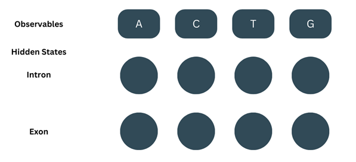

&nbsp;

#### Forward Algorithm:
(Note- We’ll be using ‘t’ to describe the position of the observable or state)

It consists of three steps-

##### 1.	Initialisation: 

At=1, the observable (O) = A. The Forward probability (α) for the first observable is the product of the corresponding initial probability and emission probability. 

α1-intron = π(intron) × b(A-intron) = 0.8 × 0.4 = 0.32

α1-exon = π(exon) × b(A-exon) = 0.2 × 0.6= 0.12

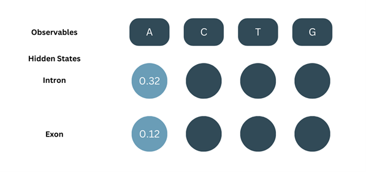

#### 2.	Recursion:
At t=2, O=C. For the next part, we’ll be considering the probability of both the previous states and adding them up i.e., For C to be an intron, we consider the transition of A in intron to C in intron and A in exon to C in intron and sum both the probabilities.
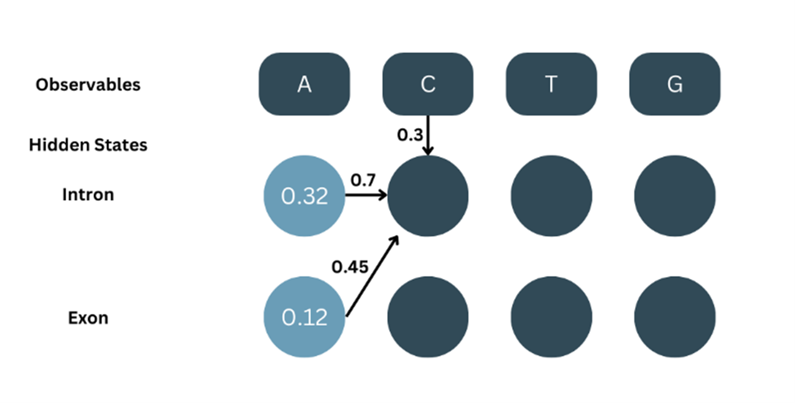

As shown in the picture:

α1-intron = 0.32, aintron-intron = 0.7

α1-exon = 0.12, aexon-exon = 0.7

bC-intron = 0.3

α2-intron = α1-intron × aintron-intron × bC-intron + α1-exon × aexon-intron × bC-intron

α2-intron = ((α1-intron × aintron-intron) + (α1-exon × aexon-intron)) × bC-intron

α2-intron = (( 0.32 × 0.7 ) + ( 0.12 × 0.7 )) × 0.3

α2-intron = ( 0.224 + 0.84 ) × 0.3

α2-intron = ( 0.308 ) × 0.3

α2-intron = 0.0924

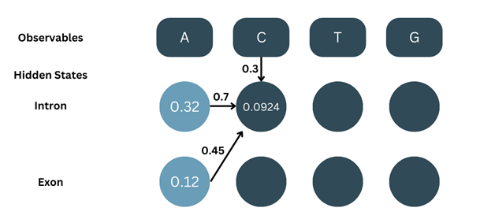

Similarly, for α2-exon…

 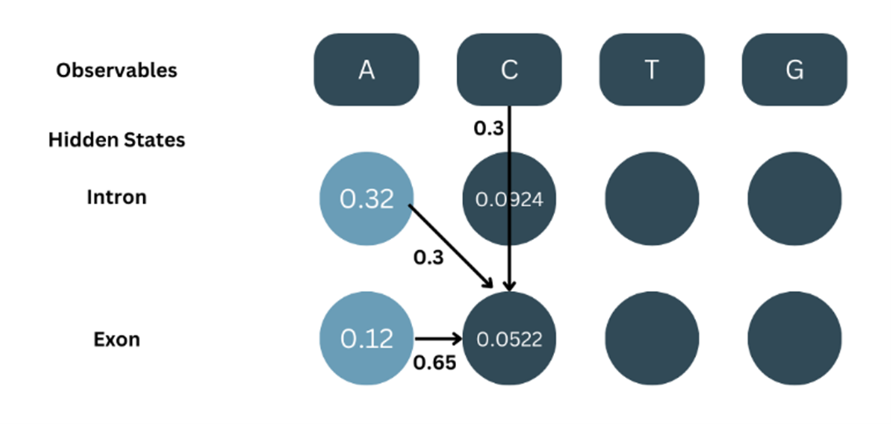

In the same manner, for the rest of the states:

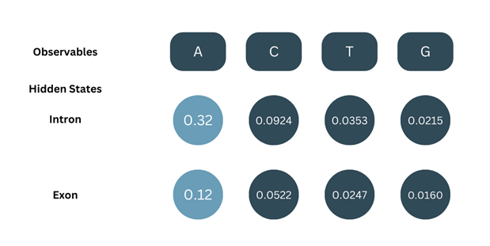

#### 3.	Termination:
The total probability for our sequence of observables, P(O) = αT-intron + αT-exon. This is basically, the sum of the α values calculated at the end of the sequence (T denotes last position).

P(O) = α4-intron + α4-exon

P(O) = 0.0215 + 0.0160

P(O) = 0.0375

Now, we have all the α values:

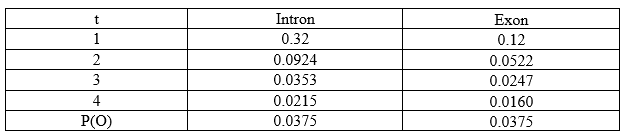

&nbsp;

####  The Backward Algorithm: