### Procedure

1.	In the simulator tab, general instructions for using the simulator are provided. Users can read them carefully before starting the experiment.

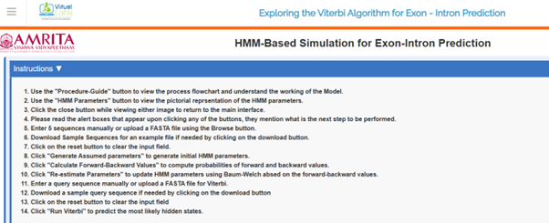

&nbsp;

2.	Users can click on Procedure-Guide tab at the bottom of the GUI to learn the basics of the algorithm

&nbsp;

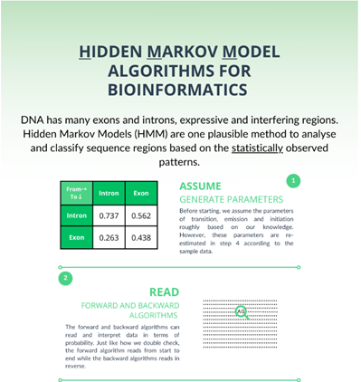

&nbsp;

3. Users can click on the HMM Parameters tab at the bottom of the GUI to learn initialization probabilities, Transition probabilities, and emission probabilities of HMM model for exon-intron prediction in a given sequence.

&nbsp;

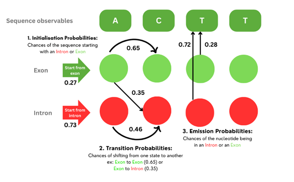

&nbsp;

 
 
4.	To start the experiment, provide sample sequences in the provided query box. The sample sequences need to be separated by newlines. Also, a user can upload a FASTA file. A sample FASTA file is provided in the GUI. Download the file, and users can use the sample FASTA file for running the simulator. 

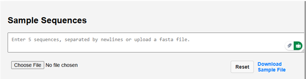

&nbsp;

5.	Click on the Choose file button to upload the sample FASTA file. The query box will show the uploaded sequence data. 

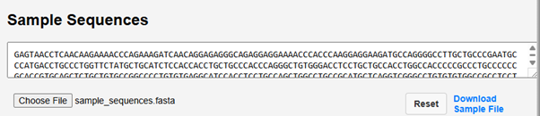

&nbsp;

6.	Next click on Generate Assumed parameters.

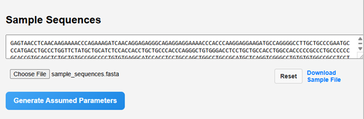

&nbsp;

7.	The assumed parameters of the HMM model, such as initial probabilities, transition matrix and emission matrix will be calculated.  

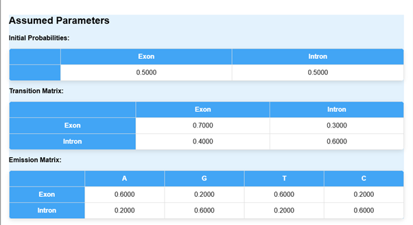

&nbsp;

8.	The next step is to click on Calculate Forward and Backward Values.

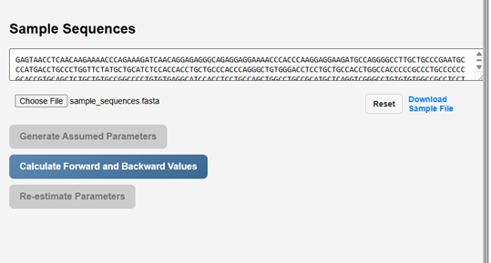

&nbsp;

9.	 It computes the probabilities of observations given a hidden state model.

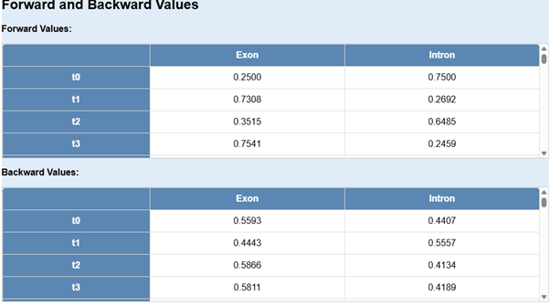

&nbsp;

10.	Next step is to click on Re-estimate parameters tab.

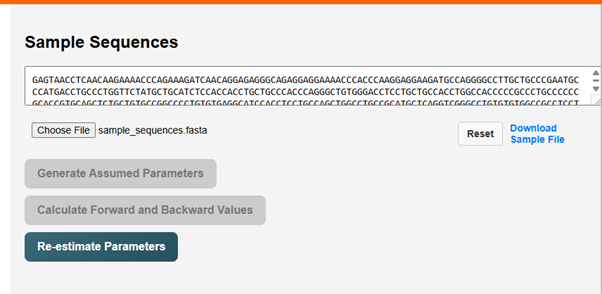

&nbsp;

11.	Re-estimating parameters in an HMM is essential for training the model using observed data. The Baum-Welch algorithm (a special case of the Expectation-Maximization (EM) algorithm) is commonly used to re-estimate HMM parameters.

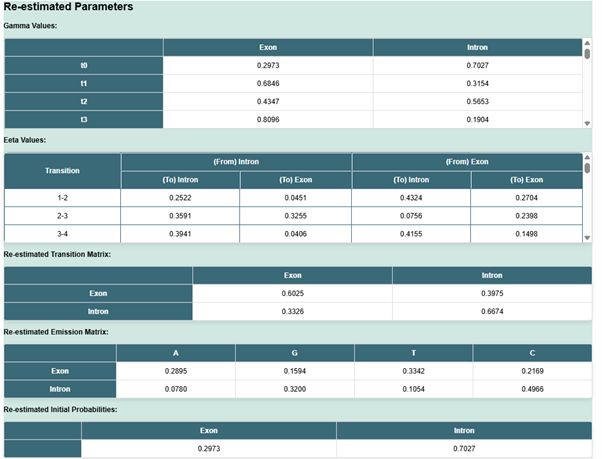

&nbsp;

12.	The next step is the execution of the Viterbi algorithm.

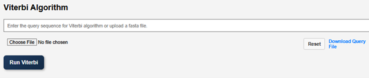

&nbsp;

 

13.	Enter the query sequence for the Viterbi algorithm or upload a FASTA file. A sample query file is provided in the GUI. Users can download the file and upload it as a query file. 

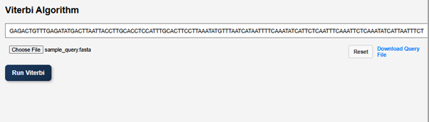

&nbsp;

14.	Click on Run Viterbi to visualize the result.

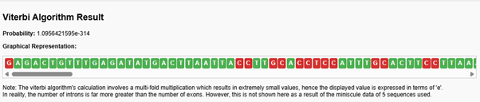

&nbsp;

 
### Result Interpretation: 
The portion of the sequence shown in red colour indicates introns and the green portion indicates exons in the given DNA sequence. In reality the number of introns are far more greater than the number of exons, but here it is not shown as we provided 5 shorter DNA sequences. 

15.	The reset button will return the simulation to its initial stage.

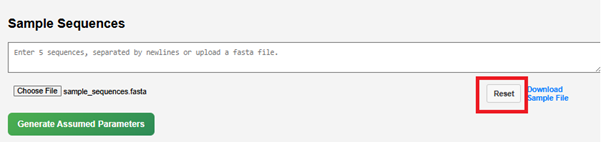

&nbsp;

